# OpenAlgo Architecture Diagram

## High-Level System Architecture

```mermaid
graph TB
    %% Client Layer
    subgraph "Client Layer"
        WEB[Web Dashboard<br/>DaisyUI + Tailwind]
        API[REST API Clients<br/>Python/Node.js/Excel]
        WS[WebSocket Clients<br/>Real-time Data]
        STRAT[Python Strategies<br/>Automated Trading]
        TELE[Telegram Bot<br/>Mobile Interface]
    end

    %% OpenAlgo Platform
    subgraph "OpenAlgo Platform"
        %% Application Layer
        subgraph "Application Layer (Flask)"
            BLUEPRINTS[Blueprints<br/>- auth, orders, dashboard<br/>- analyzer, settings<br/>- strategy, telegram]
            RESTX[RESTx API<br/>- /api/v1/* endpoints<br/>- Swagger documentation]
            STRAT_MGR[Strategy Manager<br/>- Python hosting<br/>- Process isolation<br/>- Scheduling]
        end

        %% Business Logic Layer
        subgraph "Business Logic Layer"
            ORDER_MGR[Order Manager<br/>- Place/Modify/Cancel<br/>- Smart Orders<br/>- Basket Orders]
            POS_MGR[Position Manager<br/>- Track positions<br/>- P&L calculation<br/>- Risk management]
            STRAT_ENGINE[Strategy Engine<br/>- Strategy execution<br/>- Backtesting<br/>- Performance monitoring]
            DATA_MGR[Market Data Manager<br/>- Real-time quotes<br/>- Historical data<br/>- Symbol management]
        end

        %% Broker Integration Layer
        subgraph "Broker Integration Layer"
            BROKER_ADAPTERS[Broker Adapters<br/>20+ Indian Brokers<br/>- Zerodha, Angel One<br/>- Upstox, Groww, etc.]
            WS_ADAPTERS[WebSocket Adapters<br/>- Real-time streaming<br/>- Auto-reconnection<br/>- Data transformation]
            API_ADAPTERS[REST API Adapters<br/>- Order management<br/>- Account data<br/>- Market data]
        end

        %% Infrastructure Layer
        subgraph "Infrastructure Layer"
            DB_LAYER[Database Layer<br/>- SQLite/PostgreSQL<br/>- User management<br/>- Symbol mapping<br/>- Audit logs]
            WS_PROXY[WebSocket Proxy<br/>- Port 8765<br/>- Client authentication<br/>- Subscription management]
            ZMQ[ZeroMQ Message Bus<br/>- High-performance messaging<br/>- Publisher-Subscriber pattern<br/>- Real-time data distribution]
            SECURITY[Security & Auth<br/>- Argon2 password hashing<br/>- Fernet encryption<br/>- CSRF protection<br/>- Rate limiting]
        end
    end

    %% External Systems
    subgraph "External Systems"
        BROKERS[Broker APIs<br/>- REST APIs<br/>- WebSocket feeds<br/>- Authentication]
        MARKET_DATA[Market Data Feeds<br/>- Real-time prices<br/>- Historical data<br/>- Market depth]
        CLOUD[Cloud Services<br/>- AWS deployment<br/>- Docker containers<br/>- Nginx reverse proxy]
    end

    %% Sandbox Mode
    subgraph "Sandbox Mode (API Analyzer)"
        SANDBOX[Sandbox Engine<br/>- ₹1 Crore virtual funds<br/>- Real-time LTP execution<br/>- Margin management<br/>- Auto square-off]
        EXEC_ENGINE[Execution Engine<br/>- Order processing<br/>- Position tracking<br/>- P&L calculation]
        SQUAREOFF[Square-off Scheduler<br/>- MIS auto-close<br/>- Settlement handling<br/>- Risk management]
    end

    %% Connections
    WEB --> BLUEPRINTS
    API --> RESTX
    WS --> WS_PROXY
    STRAT --> STRAT_MGR
    TELE --> BLUEPRINTS

    BLUEPRINTS --> ORDER_MGR
    BLUEPRINTS --> POS_MGR
    BLUEPRINTS --> DATA_MGR
    RESTX --> ORDER_MGR
    RESTX --> POS_MGR
    RESTX --> DATA_MGR
    STRAT_MGR --> STRAT_ENGINE

    ORDER_MGR --> BROKER_ADAPTERS
    POS_MGR --> BROKER_ADAPTERS
    DATA_MGR --> WS_ADAPTERS
    DATA_MGR --> API_ADAPTERS

    BROKER_ADAPTERS --> BROKERS
    WS_ADAPTERS --> MARKET_DATA
    API_ADAPTERS --> BROKERS

    WS_PROXY --> ZMQ
    WS_ADAPTERS --> ZMQ
    ZMQ --> WS_PROXY

    ORDER_MGR --> DB_LAYER
    POS_MGR --> DB_LAYER
    STRAT_ENGINE --> DB_LAYER
    DATA_MGR --> DB_LAYER

    BLUEPRINTS --> SECURITY
    RESTX --> SECURITY

    %% Sandbox connections
    ORDER_MGR -.-> SANDBOX
    SANDBOX --> EXEC_ENGINE
    SANDBOX --> SQUAREOFF
    EXEC_ENGINE --> DB_LAYER
    SQUAREOFF --> DB_LAYER

    %% External connections
    BROKER_ADAPTERS --> BROKERS
    WS_ADAPTERS --> MARKET_DATA
    API_ADAPTERS --> BROKERS
    DB_LAYER --> CLOUD
```

## Detailed Component Architecture

## Data Flow Architecture

## Deployment Architecture

## Key Features Architecture

This comprehensive architecture diagram shows:

1. **Multi-layered Architecture**: Clear separation between client, application, business logic, integration, and infrastructure layers
2. **Broker Agnostic Design**: Unified API layer supporting 20+ Indian brokers
3. **Real-time Infrastructure**: WebSocket proxy with ZeroMQ message bus for high-performance data distribution
4. **Strategy Hosting**: Complete Python strategy execution environment with process isolation
5. **Sandbox Mode**: Risk-free testing environment with virtual funds
6. **Security**: Comprehensive security measures including encryption, rate limiting, and audit logging
7. **Monitoring**: Advanced monitoring and analytics capabilities
8. **Scalability**: Support for multiple deployment scenarios (development, production, Docker)

The architecture is designed to be modular, extensible, and maintainable while providing a unified interface for algorithmic trading across multiple brokers.
